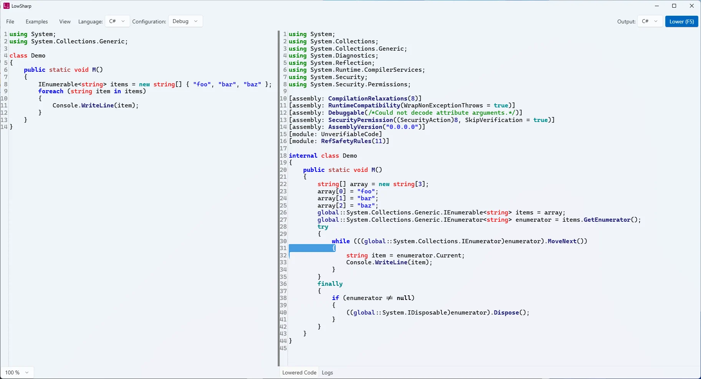

# Lowsharp

A standalone app for viewing the lowered, compiler-generated C# code from C#, VB.NET, and F# source code.

  
## Features

- Supports C#, VB.NET, and F# source code.
- Displays the lowered code generated by the Roslyn and F# compilers.
- User-friendly interface for easy navigation and viewing of code.
- Easy to install. Just download and run the executable.
- App uses the same open-source Roslyn and F# compiler libraries as Visual Studio.
- Completely offline. No internet connection required.
- Core can be used as a library in other .NET applications.
